# InLong项目实践：个贷违约预测

本项目为基于Apache InLong的项目实践，使用了InLong的自主消费模式。

本项目的实践内容包括数据收集与数据传输。


## 简介

本节将对**Apache InLong**与**Personal Loan Default Forecast**（个贷违约检测）进行简单的介绍。


### Apache InLong

- [Apache InLong](https://inlong.apache.org)是一站式的海量数据集成框架，提供自动、安全、可靠和高性能的数据传输能力，方便业务构建基于流式的数据分析、建模和应用。 InLong 项目原名 TubeMQ ，专注于高性能、低成本的消息队列服务。为了进一步释放 TubeMQ 周边的生态能力，我们将项目升级为InLong，专注打造一站式海量数据集成框架。 Apache InLong 依托 10 万亿级别的数据接入和处理能力，整合了数据采集、汇聚、存储、分拣数据处理全流程，拥有简单易用、灵活扩展、稳定可靠等特性。 
- 该项目最初于 2019 年 11 月由腾讯大数据团队捐献到 Apache 孵化器，2022 年 6 月正式毕业成为 Apache 顶级项目。目前 InLong 正广泛应用于广告、支付、社交、游戏、人工智能等各个行业领域，为多领域客户提供高效化便捷化服务。


### Personal Loan Default Forecast

- 问题提出
  - 为进一步促进金融普惠的推广落地，金融机构需要服务许多新的客群。银行作为对风险控制要求很高的行业，因为缺乏对新客群的了解，对新的细分客群的风控处理往往成为金融普惠的重要阻碍。如何利用银行现有信贷行为数据来服务新场景、新客群成了一个很有价值的研究方向，迁移学习是其中一个重要手段。其中金融惠普是指国家为特殊群体所提供的一种福利金融服务，那自然而然需要考察服务对象之前的信誉水平和当前的经济水平。
  - Personal Loan Default Forecast（个贷违约预测）问题要求利用已有的与目标客群稍有差异的另一批信贷数据，辅助目标业务风控模型的创建，两者数据集之间存在大量相同的字段和极少的共同用户。在此基础上希望可以利用迁移学习捕捉不同业务中用户基本信息与违约行为之间的关联，帮助实现对新业务的用户违约预测。

- 总体思路
  - 该问题共有两个训练数据，其中对于个人贷款违约数据，由于字段过多，即特征过多，我们到时候肯定需要对数据进行预处理，因此通过观察把各字段大致分成了三种类别，第一种是对个人信息的描述，如个人的工作年限，公司类型，是否有房等；第二种是对贷款信息的描述，如贷款的数额，年份等；第三种是对借贷人信誉水平的评估，如借款人在贷款评分中所属的范围，借款人提前还款次数等。


## InLong安装与部署

本节将描述InLong及其相关软件的安装与部署流程。


### 环境

```
Ubuntu 20.04.6 LTS
```


### Docker

#### Docker 安装

1. 卸载旧版本Docker库

```
sudo apt-get remove docker docker-engine docker.io containerd runc
```

2. 获取软件最新源

```
sudo apt-get update
```

3. 安装 apt 依赖包

```
sudo apt-get -y install apt-transport-https ca-certificates curl software-properties-common
```

   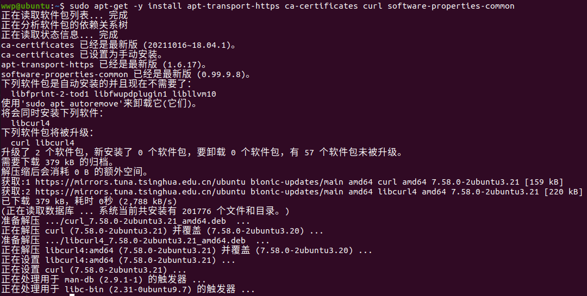

4. 安装GPG证书

```
curl -fsSL https://mirrors.aliyun.com/docker-ce/linux/ubuntu/gpg | sudo apt-key add -
```

   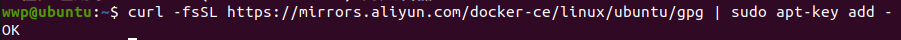

5. 验证

```
sudo apt-key fingerprint 0EBFCD88
```

   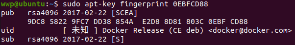

6. 设置稳定版仓库

```
sudo add-apt-repository "deb [arch=amd64] https://mirrors.aliyun.com/docker-ce/linux/ubuntu $(lsb_release -cs) stable"
```

   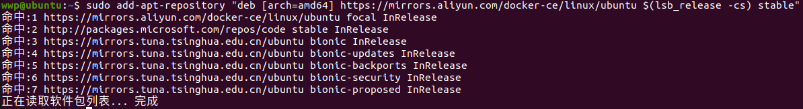


#### Docker-Engine 安装

1. 更新 apt 包索引

```
sudo apt-get update
```

2. 安装最新版本

```
sudo apt-get install docker-ce docker-ce-cli containerd.io
```

   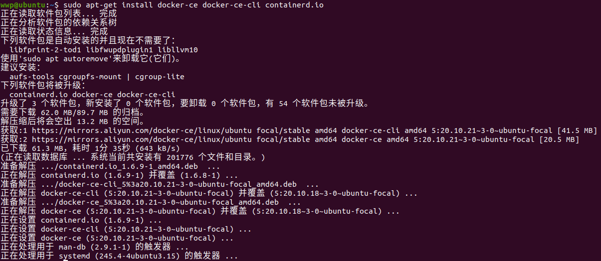

3. 测试

```
sudo docker run hello-world
```

   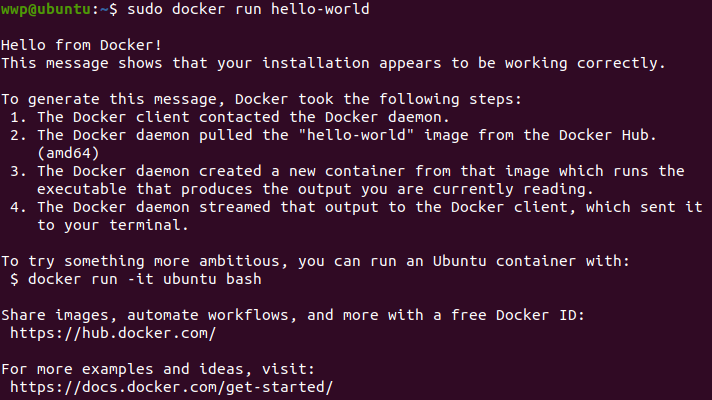


#### Docker-Compose 安装

1. 切换至root用户

```
sudo -i
```

2. 下载安装

```
curl -L https://get.daocloud.io/docker/compose/releases/download/v2.6.1/docker-compose-`uname -s`-`uname -m` > /usr/local/bin/docker-compose
```

   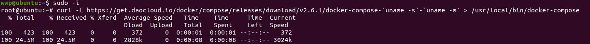

3. 授权

```
sudo chmod +x /usr/local/bin/docker-compose
```

4. 查看

```
docker-compose -v
```

   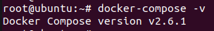


#### 参考链接

`https://blog.csdn.net/u012590718/article/details/125632482`

`https://blog.csdn.net/u012590718/article/details/125702606`


### InLong-部署

#### 操作步骤

1. 下载&解压

    `https://downloads.apache.org/inlong/1.6.0/apache-inlong-1.6.0-bin.tar.gz`

2. 开启Docker

   ```
   service docker start
   ```

4. 部署

   - 切换至root用户

   - 切换路径至apache-inlong-1.6.0/docker/docker-compose

   - 运行

   ```
   docker-compose up -d
   ```

   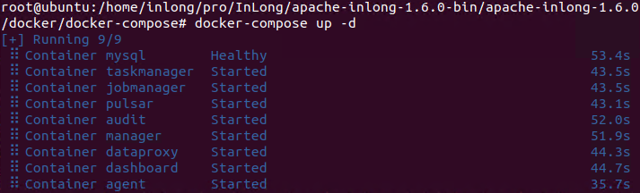

5. 使用

`localhost`

admin@inlong   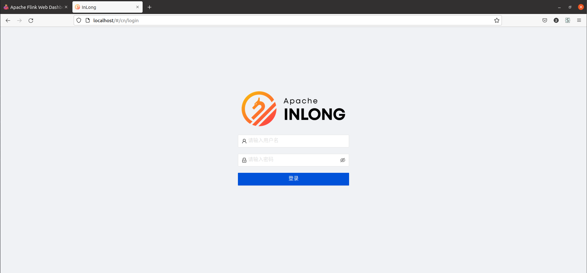

   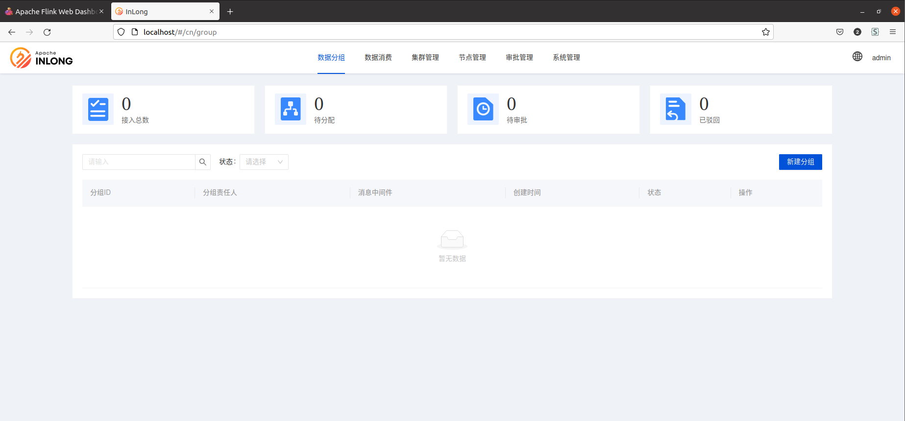

注：若进入Inlong后未显示登录界面，而是直接跳转至首页且右上角无用户名，同时有http error弹出，稍作等待刷新即可。


#### 参考链接

`https://inlong.apache.org/zh-CN/docs/introduction`


## InLong项目实例：个贷违约检测

本节将介绍使用InLong进行实践的具体流程。

我们将使用InLong的自主消费模式进行数据传输，将个贷违约预测问题所需的三个数据集通过InLong分别发往数据队列pulsar的不同topic中，之后从pulsar中取出数据并以文件形式存储。


### InLong使用

#### 新建集群标签

```
[集群管理]->[标签管理]->[新建]，指定集群标签名称和负责人
注：由于各个组件默认上报集群标签为default_cluster，请勿使用其它名称。
```

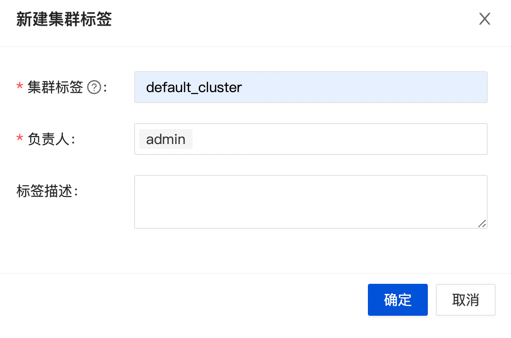


#### 注册Pulsar集群

```
[集群管理]->[集群管理]->[新建集群]，注册 Pulsar 集群
```

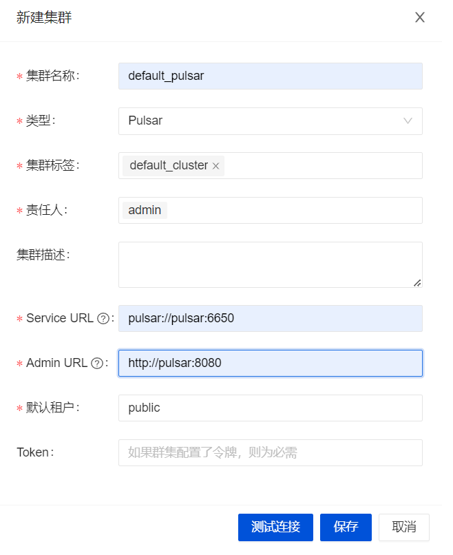


#### 新建数据流组

1. 使用用户名密码（admin@inlong）登录至Inlong数据集成主界面

   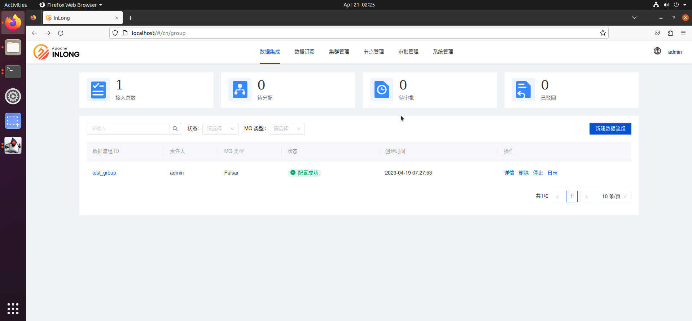


2. 点击新建数据流组，进入数据流组创建界面

```
分别输入数据流组ID，责任人。
选择MQ(消息队列)类型，示例中我们选择Pulsar
```

   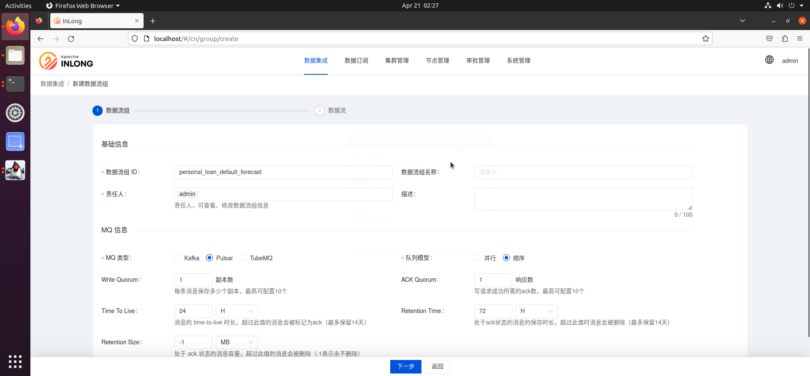


3. 点击下一步，进入数据流创建界面

   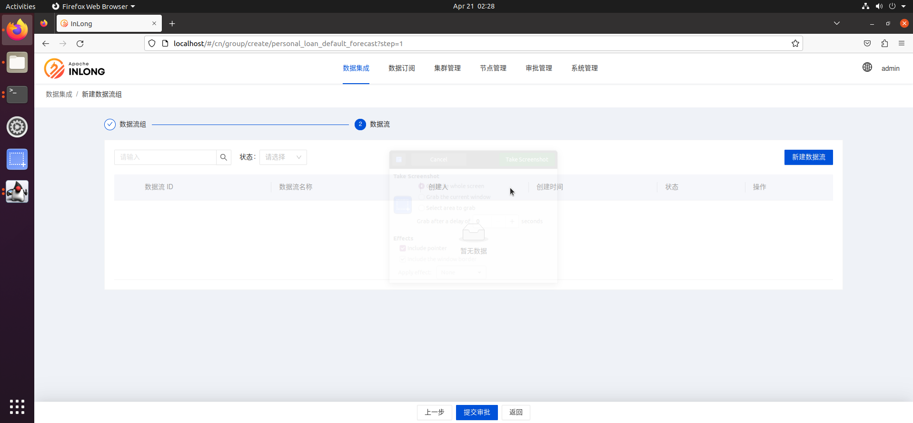


4. 点击新建数据流，创建数据流

```
分别输入数据流ID，选择数据格式，数据编码，点击确定，完成数据流的创建。
注：源数据字段-字段名随意填写即可。
```

   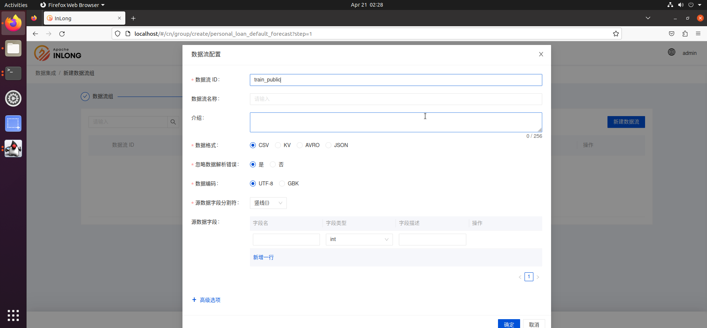


5. 点击新建数据源，创建数据来源

```
分别输入数据源名称，选择类型、集群名称、数据源IP，输入文件路径，完成数据来源的创建。
注：
	数据源IP为 docker-agent 容器的IP，其下的
    /data/collect-data/ 路径
	已与终端所在路径（运行 docker-compose up -d 时的路径）下的
    /collect-data/ 路径挂载。
```

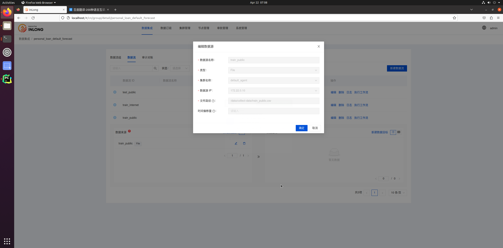


6. 重复第4、5步，完成三个数据流及数据来源的创建，最后点击提交审批，完成数据流组的创建过程

   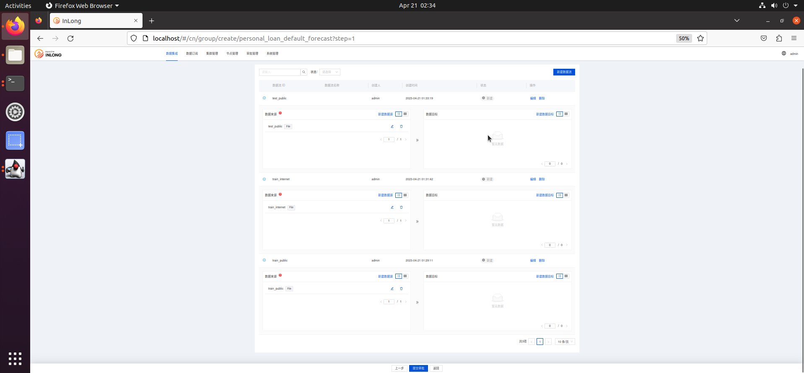


#### 审批新建的数据流组

1. 点击进入审批管理界面，可以看到我们刚刚创建的数据流组目前的状态处于待审批

   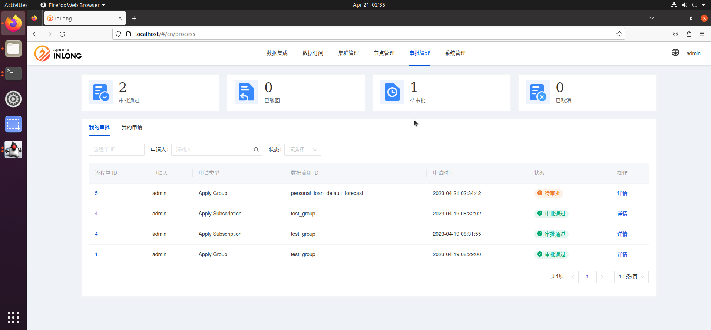


2. 点击详情，选择集群标签和数据上报方式（发往MQ），点击通过

   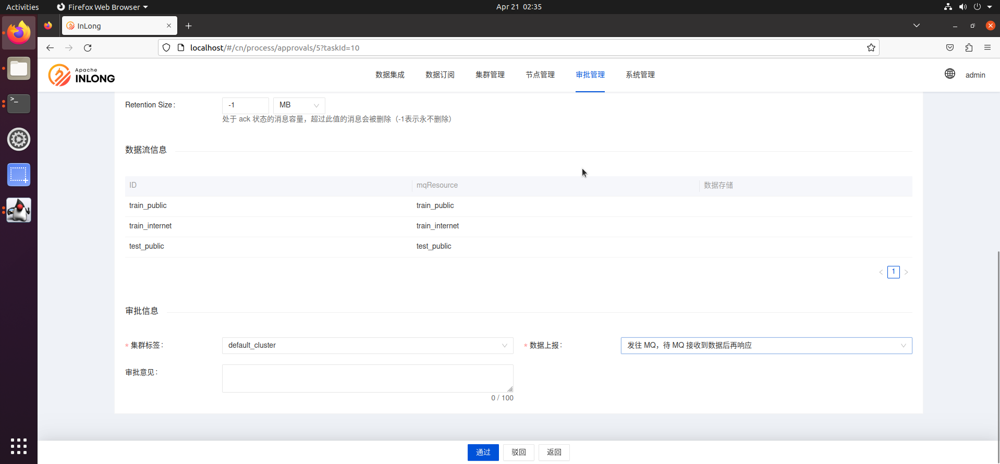


3. 回到数据集成的界面，可以看到我们刚刚创建的数据流组配置成功

   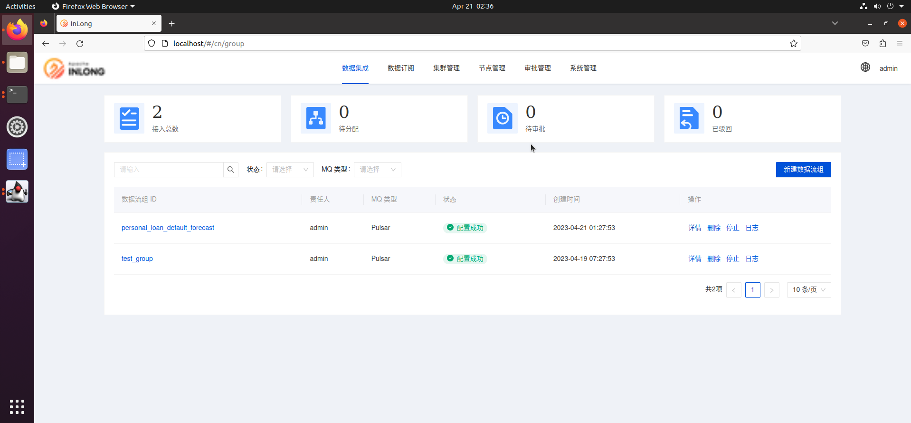


#### 新建数据订阅

1. 点击进入数据订阅界面

   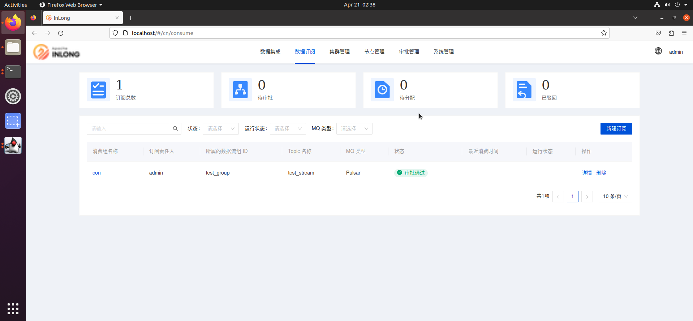


2. 点击新建订阅，随后选择消费组名称，订阅负责人，所属的数据流组ID，Topic名称，点击提交审批

   ```
   注：Topic名称即数据流名称。
   ```
   
   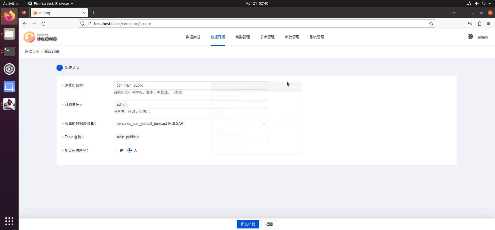


3. 重复第二步，完成三个数据订阅的创建，如图可以看到我们刚刚创建的三个数据订阅目前的状态处于待审批

   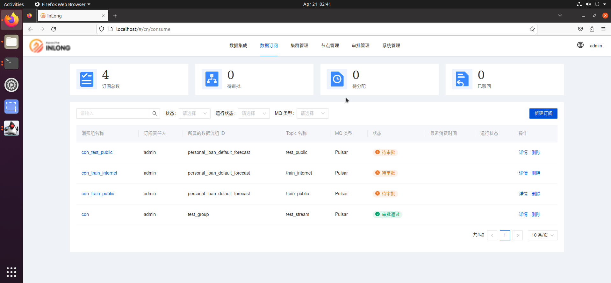


4. 点击进入审批管理界面,对刚刚创建的三个数据订阅分别审批通过，随后回到数据订阅界面

   ```
   注：每个订阅需两次审批。
   ```
   
   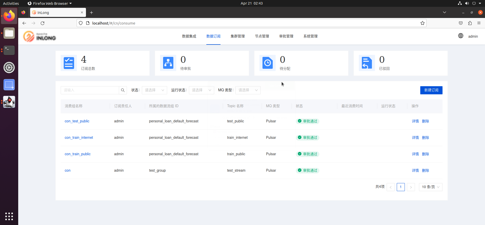


### Pulsar使用

#### JDK安装（以JDK8为例）

```
sudo apt install openjdk-8-jdk
```


#### 文件资源获取

```
https://github.com/wang273257881/inlong-pulsar-demo.git
拉至本地后解压data.zip文件
```


#### Python依赖安装


   ```
cd inlong-pulsar-demo
pip install -r requirements.txt
   ```


#### Pulsar状态确定

1. 在root终端下，输入

   ```
   docker ps -a
   ```

   确定apachepulsar容器处于启动状态

   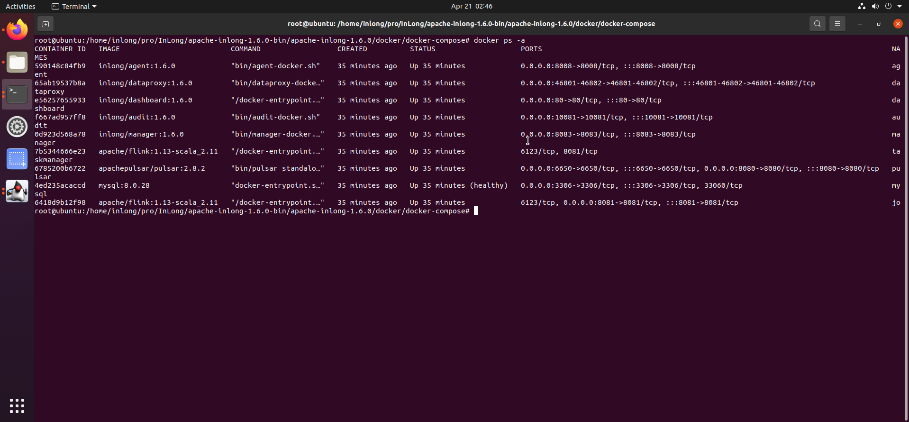

2. 在终端输入

   ```
   curl http://localhost:8080/admin/v2/persistent/public/personal_loan_default_forecast/train_public/stats | python3 -m json.tool
   ```

   确定有JSON格式的数据输出

   ```
   注：链接的 personal_loan_default_forecast/train_public 部分即 数据流组ID/数据流ID，三数据流选一即可。若无正常输出，请在确保第1步的情况下稍等片刻。
   ```

   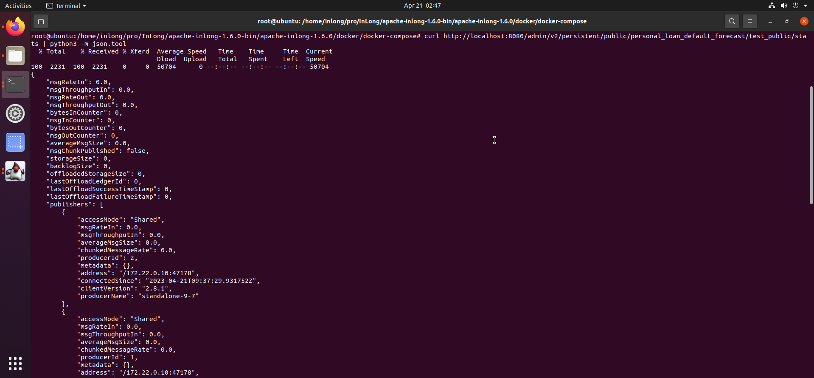


#### Pulsar消费

1. 查看topic信息

   ```
   [数据订阅]->[选择一消费组]->[详情]，记录Topic名称与消费组名称。
   注：在新建的三个数据订阅中选择其一即可。
   ```

   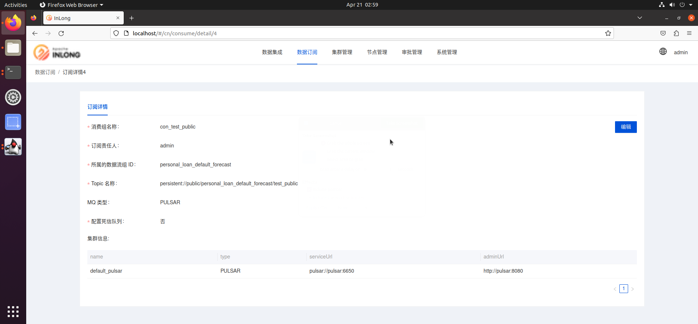

2. 查看并修改 inlong-pulsar-demo/consumer.py

   ```
   将__main__中的函数参数改为第1步中记录的相应Topic名称与消费组名称。
   注：若与本示例保持一致，则无需修改。
   ```

   
   
3. 运行 inlong-pulsar-demo/consumer.py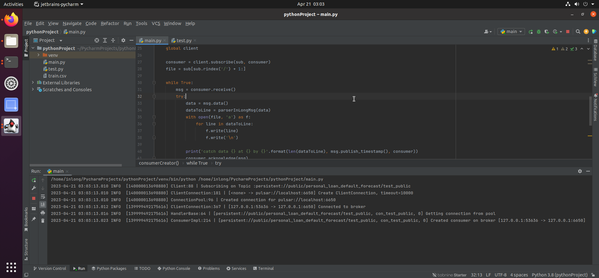

4. 将 inlong-pulsar-demo 的**与数据流组对应的**csv文件放至 collect-data 路径下

   ```
   例：cp /path/to/inlong-pulsar-demo/data/train_internet.csv /path/to/apache-inlong-1.6.0/docker/docker-compose/collect-data/train_internet.csv
   ```
   
5. 观察运行状态，直至消息不再跳动

   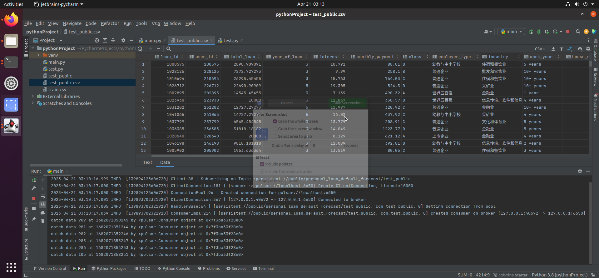

6. 停止运行，此时路径下应有相应文件，且在InLong中的相应数据流组的审计对账界面可以看到相关的数据传输曲线。

   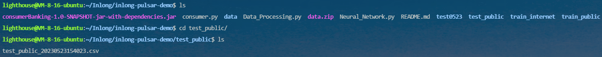

   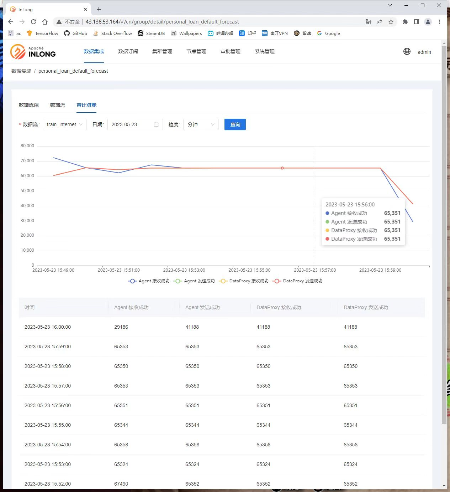

7. 按照不同数据流组对应的数据订阅、文件，修改参数并重复第2-6步，共3次。
