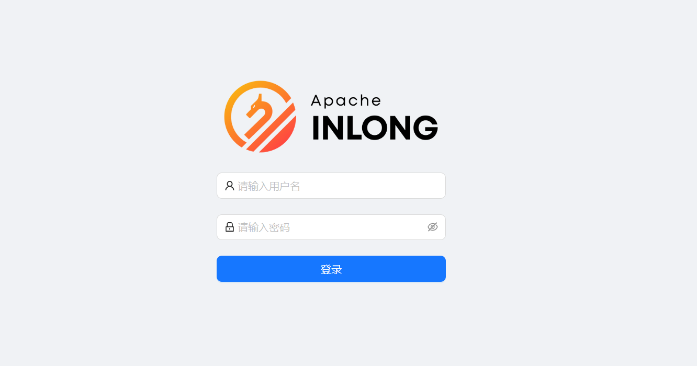
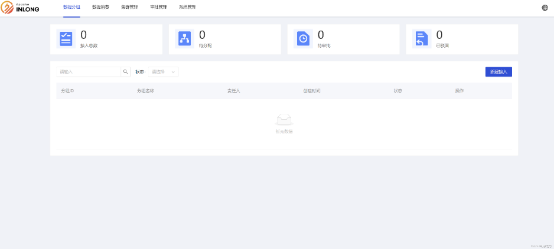
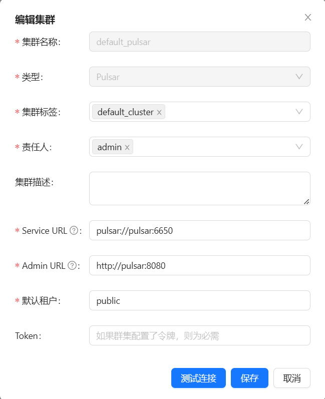
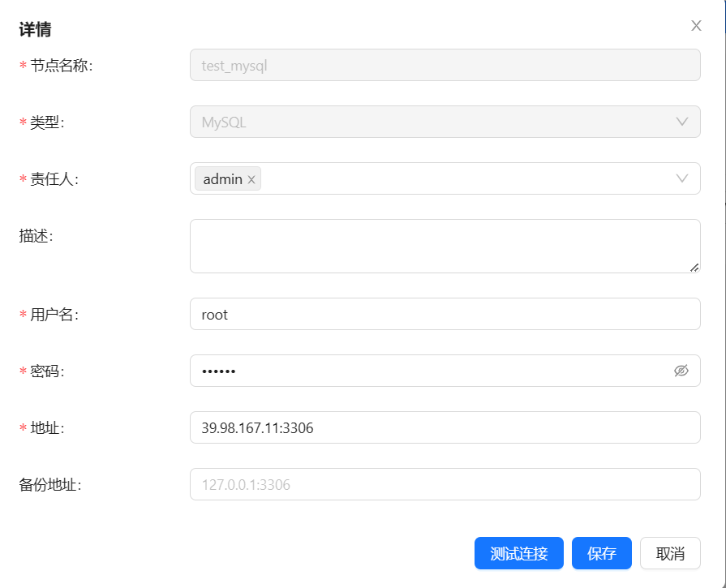
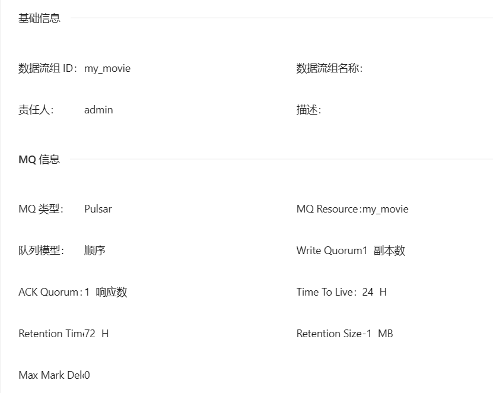
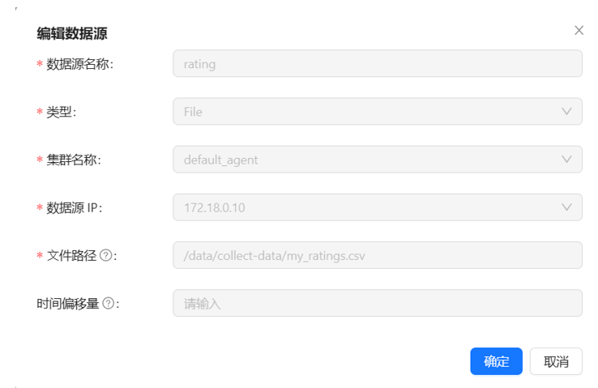
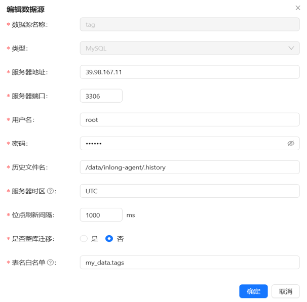
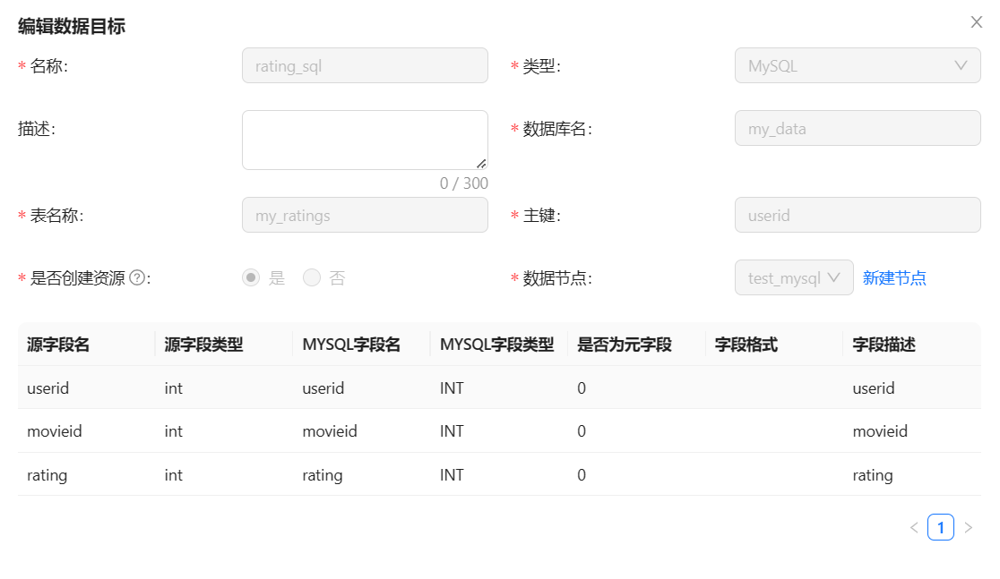
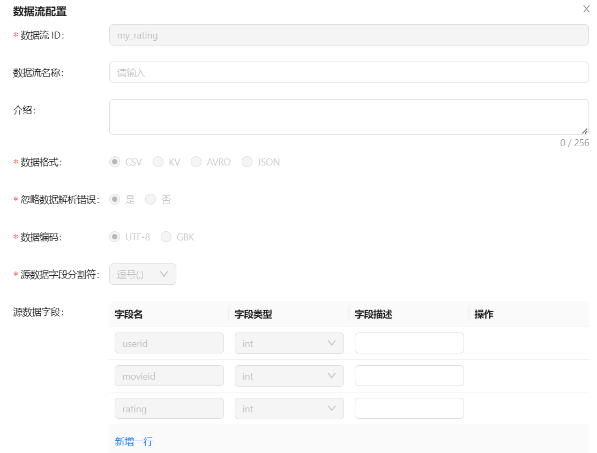
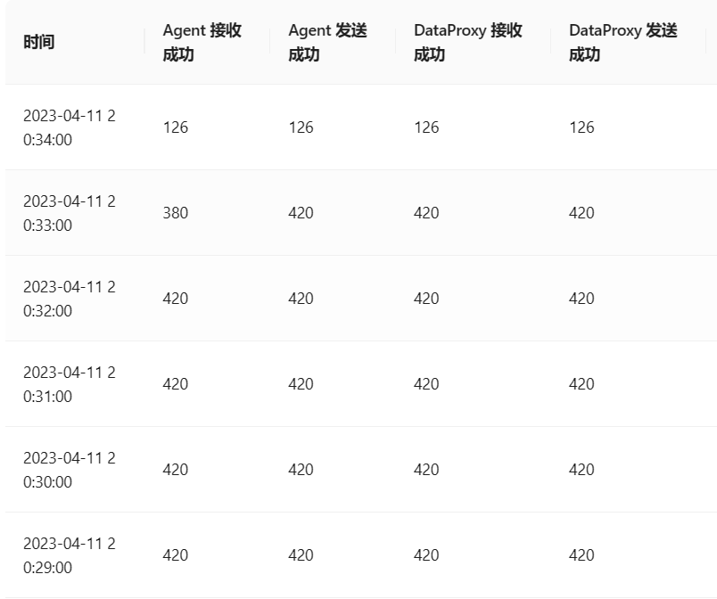

## 使用 Apache InLong 把csv文件内容采集到mysql中


### Apache Inlong 部署

​本文主要使用 docker 部署模式，将 Apache InLong 部署在服务器上。

其中，使用 docker compose 部署 Apache InLong 的方式适用于开发和调试模式，不适用于生产环境当中。

该种模式包含了 Inlong 标准架构所需要的所有组件，并使用 Apache Pulsar 作为消息队列服务。

#### Apache Inlong 下载

​在[下载 | Apache InLong](https://inlong.apache.org/zh-CN/download/) 页面下载apache-inlong-[version]-bin.tar.gz，然后安装至linux服务器中。

本文使用Centos 7.9，下载和安装 InLong 的版本是 1.6。

#### 启动集群

```
cd docker/docker-compose
docker-compose up -d
```

​集群成功启动之后，可以访问 InLong Dashboard，地址 http://localhost ，





并使用以下默认账号登录:

```
User: admin
Password: inlong
```




### Apache Inlong 配置

#### 注册 pulsar 集群

​页面点击 [集群管理]->[集群管理]->[新建集群]，注册 Pulsar 集群：



​测试连接是否正常，正常进行下一步。集群标签、责任人、url等为默认参数，不必更改。

#### 配置 mysql 数据库



ip、用户名、密码为自己服务器的内容，根据服务器更改。

#### 配置数据流



​字段及类型根据实验内容进行修改。

#### 配置 csv 文件数据源



数据源IP：与集群管理中agent节点的IP保持一致。

文件路径：在agent容器中的 /data/collect-data 目录下存放。

#### 配置 mysql 数据源

​使用 MySQL 作为数据源，配置如下：



ip、用户名、密码、表名白名单根据需要更改。

my_data.tags: my_data为数据库名，tags为数据库表名

#### 配置数据目的地址 MySQL



​数据节点即为前面注册的数据库节点。

#### 数据采集

​完成以上配置之后，点击提交，经过负责人审查同意之后，便可以开始采集任务，直至数据采集完成。


### 使用示例

1. 根据上述内容完成 Inlong 基本配置。

2. 本示例把 csv 文件内容采集到 mysql 中，文件包含userId，movieId，rating三个字段。

3. 数据流配置信息如下：



4. 数据源配置信息如下：


5. 接收端配置如下：


6. 完成提交后，采集端页面展示如下：

