## 使用 Apache InLong 创建文件到 ClickHouse 数据流


### 资源准备

- 下载 Apache InLong 1.6.0 安装包，下载地址：https://inlong.apache.org/zh-CN/downloads/
- 安装 Docker、Docker Compose 环境

### 环境部署

- 安装 Apache InLong 解压 apache-inlong-1.6.0-bin.tar.gz，并执行：

```
cd docker/docker-compose

# changes-1.6.0.sql 会影响安装，可以先移走
mv sql/changes-1.6.0.sql sql/changes-1.6.0.sql.bk

# 启动
docker-compose up -d

```


- 安装 ClickHouse

```
docker run -d --rm --net=host --name clickhouse -e CLICKHOUSE_USER=admin -e CLICKHOUSE_PASSWORD=inlong -e CLICKHOUSE_DEFAULT_ACCESS_MANAGEMENT=1 clickhouse/clickhouse-server:22.8
```

### 集群初始化
当所有容器都成功启动后，可以访问 InLong Dashboard 地址 http://localhost ，

并使用以下默认账号登录:

```
User: admin
Password: inlong
```

- 创建集群标签

页面点击 【集群管理】->【标签管理】->【新建】，指定集群标签名称和负责人：

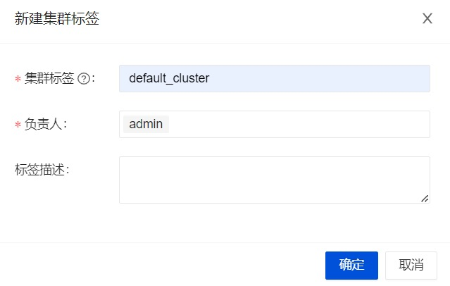

注意：由于各个组件默认上报集群标签为 default_cluster，请勿使用其它名称。

- 注册 Pulsar 集群

页面点击 【集群管理】->【新建集群】，注册 Pulsar 集群：

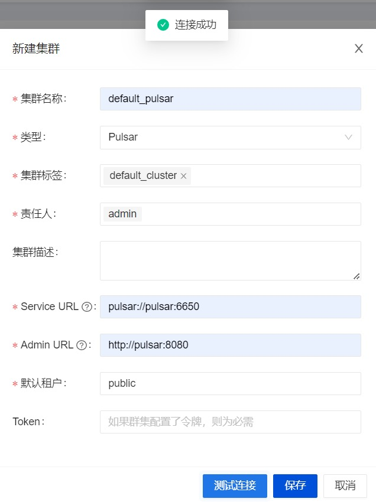

可以参考截图信息填写内部，包括集群名称、所属标签、Pulsar 集群地址等

- 注册 ClickHouse 数据节点

页面点击 【节点管理】→【新建】，新增 ClickHouse 数据节点：

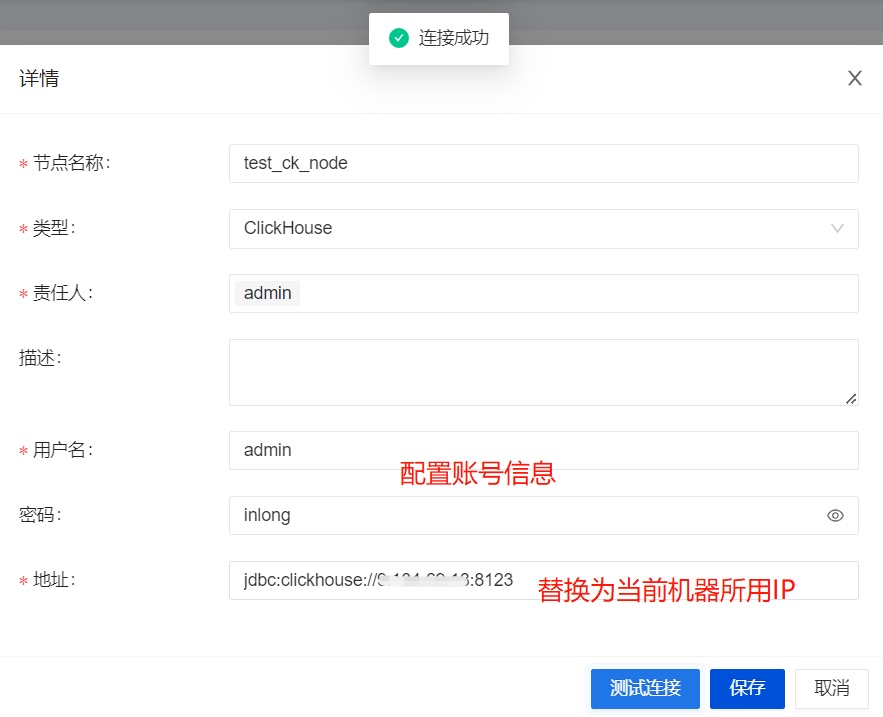

### 任务创建
- 新建数据流组

页面点击【数据集成】→【新建数据流组】，只用填写 ID 接选择 Pulsar 即可：

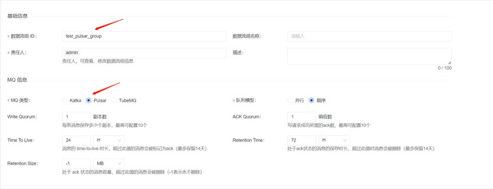

注：如果需要使用kafka，需要修改 docker-compose.yml 中的 MQ_TYPE。

- 新建数据流

点击【下一步】→【新建数据流】，配置 ID 及测试源字段信息：

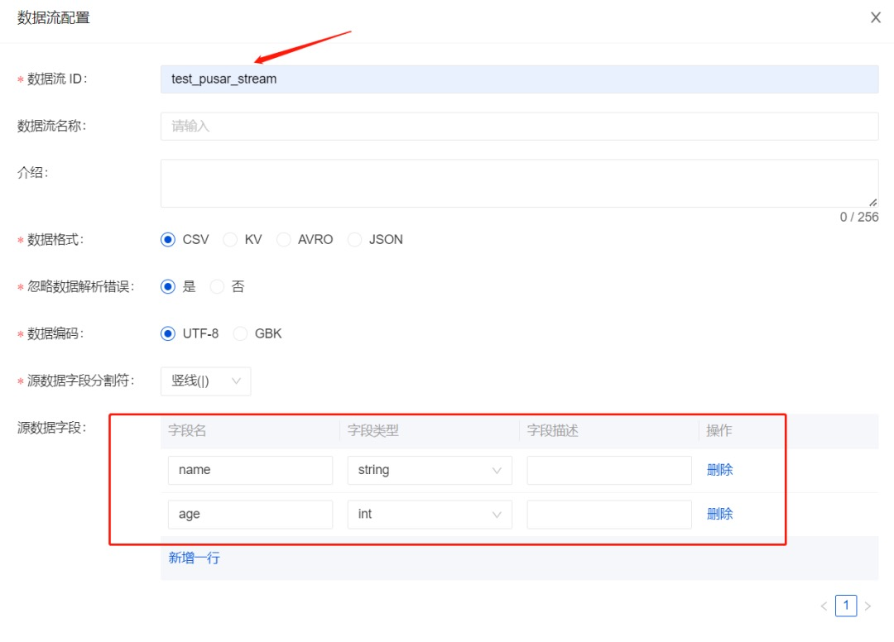

- 为数据流添加文件数据源

点击【新建数据源】，配置数据源信息，包括名称、选择 File 类型、选择采集 Agent 集群及 IP 、采集文件路径等；

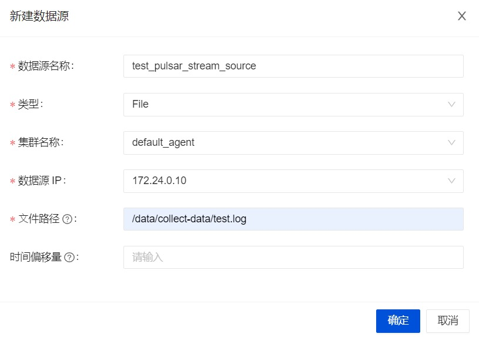

- 为数据流添加 ClickHouse 目标端

点击【新建数据目标】，包括名称、配置 ClickHouse 后的库表名称、选择已创建的节点及 Schema 映射信息等，然后点击【提交审批】：

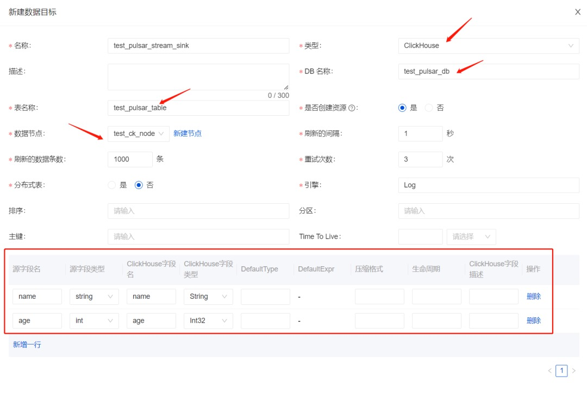

- 审批数据流

页面点击【审批管理】->【我的审批】->【详情】->【选择集群标签】->【通过】：

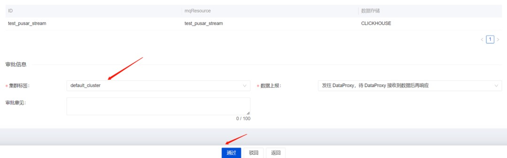

然后回到【数据集成】页面，并等待配置成功：

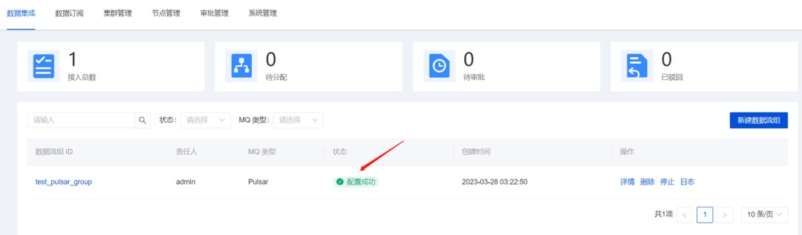

### 测试数据
- 进入 Agent 容器：

```
docker exec -it agent /bin/bash
```

- 发送数据

```
# 采集文件 /data/collect-data/test.log 数据源配置路径，总共发送 10001 条
for i in {0..10000};do echo "name_$i | $i" >> /data/collect-data/test.log ;done
```

- 数据验证

可以查看页面审计发送数据（约一分钟左右）：

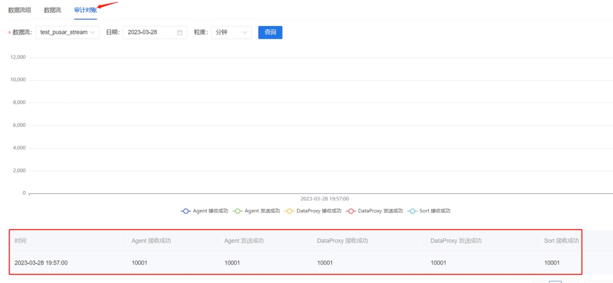

然后进 ClickHouse 容器，并查看库表数据：

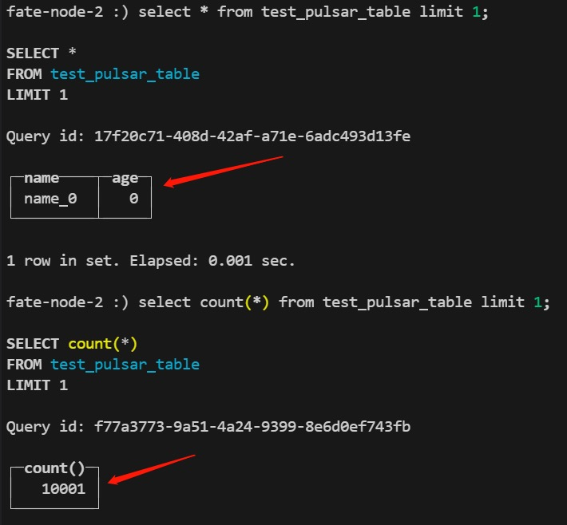

### 常见问题
- Docker Compose 启动出现“specify container image platform”

API 不兼容导致，可以删除 docker-compose.yml 中的 platform: "linux/x86_64"，执行。

- 数据流配置错误

一般是 MQ 或者 Flink 集群配置错误导致，可以在页面查看错误信息，或者进入 Manager 容器查看详细日志。

