# 准备工作——Docker

### Docker 安装

1. 卸载旧版本Docker库
```
sudo apt-get remove docker docker-engine docker.io containerd runc
```

2. 获取软件最新源
```
sudo apt-get update
```

3. 安装 apt 依赖包
```
sudo apt-get -y install apt-transport-https ca-certificates curl software-properties-common
```
   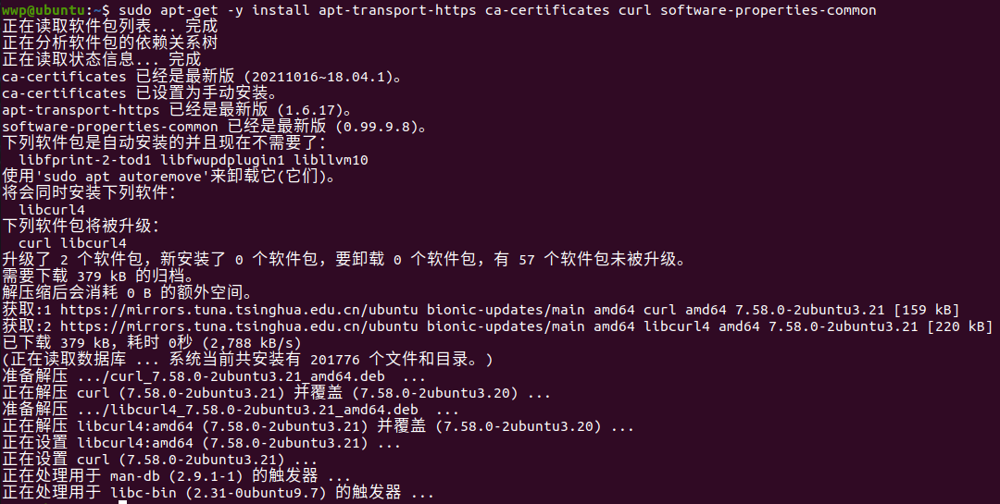

4. 安装GPG证书
```
curl -fsSL https://mirrors.aliyun.com/docker-ce/linux/ubuntu/gpg | sudo apt-key add -
```
   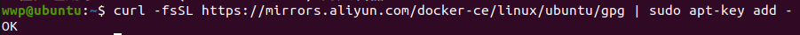

5. 验证
```
sudo apt install openjdk-8-jdk
```
   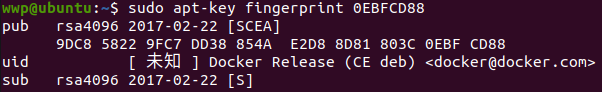

6. 设置稳定版仓库
```
sudo add-apt-repository "deb [arch=amd64] https://mirrors.aliyun.com/docker-ce/linux/ubuntu $(lsb_release -cs) stable"
```
   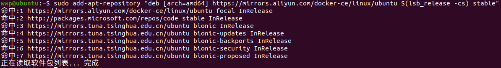

### Docker-Engine 安装
1. 更新 apt 包索引
```
sudo apt-get update
```
2. 安装最新版本
```
sudo apt-get install docker-ce docker-ce-cli containerd.io
```
   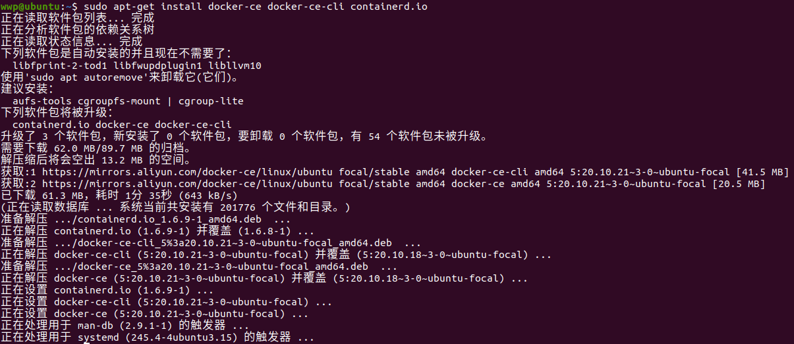

3. 测试
```
sudo docker run hello-world
```
   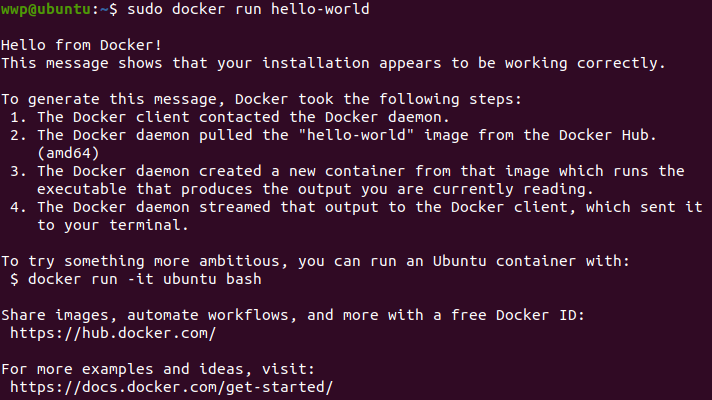

### Docker-Compose 安装
1. 切换至root用户
```
sudo -i
```
2. 下载安装
```
curl -L https://get.daocloud.io/docker/compose/releases/download/v2.6.1/docker-compose-`uname -s`-`uname -m` > /usr/local/bin/docker-compose
```
   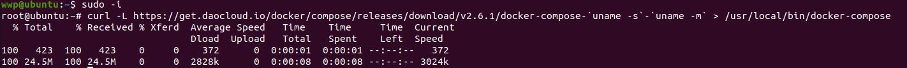

3. 授权
```
sudo chmod +x /usr/local/bin/docker-compose
```
4. 查看
```
docker-compose -v
```
   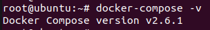

### 参考链接

`https://blog.csdn.net/u012590718/article/details/125632482`

`https://blog.csdn.net/u012590718/article/details/125702606`

# Flink

### JDK安装（以JDK8为例）

```
sudo apt install openjdk-8-jdk
```

### Flink安装
1. 下载压缩包
`https://www.apache.org/dyn/closer.lua/flink/flink-1.15.2/flink-1.15.2-bin-scala_2.12.tgz`
2. 前往下载路径解压&进入Flink根目录
```
tar -xzf flink-1.15.2-bin-scala_2.12.tgz
cd flink-1.15.2-bin-scala_2.12
```
注：根据下载文件的版本与解压方式的不同，相应文件/文件夹名可能会产生变化。
3. 启动Cluster
```
./bin/start-cluster.sh
```
   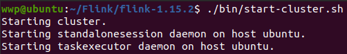

4. 查看效果
`localhost:8081`
   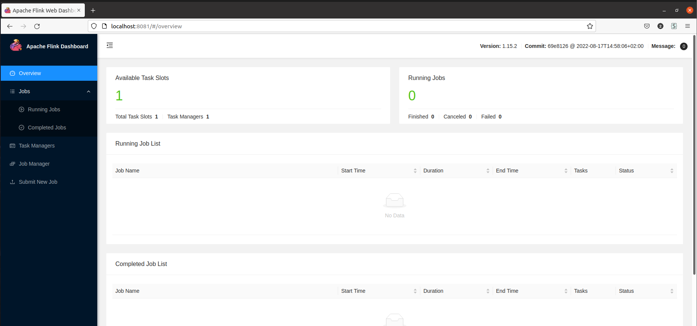

### 参考链接
`https://nightlies.apache.org/flink/flink-docs-release-1.13/docs/try-flink/local_installation/`

# InLong

### 操作步骤

1. 下载&解压

`https://downloads.apache.org/inlong/1.3.0/apache-inlong-1.3.0-bin.tar.gz`

2. 开启Docker

   ```
   service docker start
   ```

3. 开启Flink（于Flink根目录）

   ```
   ./bin/start-cluster.sh
   ```

4. 部署

   - 切换至root用户

   - 切换路径至apache-inlong-1.3.0/docker/docker-compose

   - 运行
   ```
   docker-compose up -d
   ```

   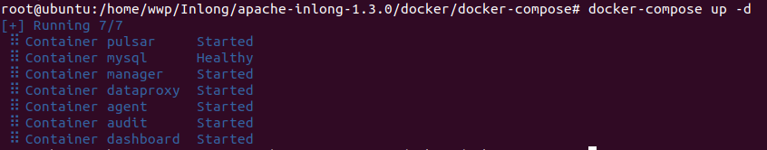
   
   - 出现下载包时无限等待等情况无法完成部署，也可以加载已打包好的镜像完成部署。
     打包好的镜像地址:
     
        ```
     链接：https://pan.baidu.com/s/1vMqmQ-lB2EHH_lkAjv4PBg 
     提取码：87vy
        ```

     下载下来后放到docker/docker-compose文件夹下，
     终端输入命令：type images.tar | docker load
     等待一阵子后，重新输入命令docker-compose up -d


5. 使用

`localhost`
   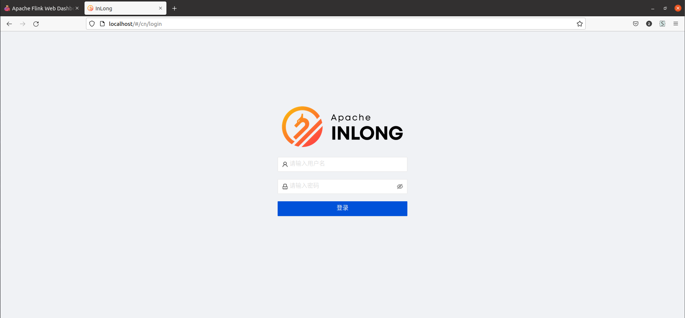

   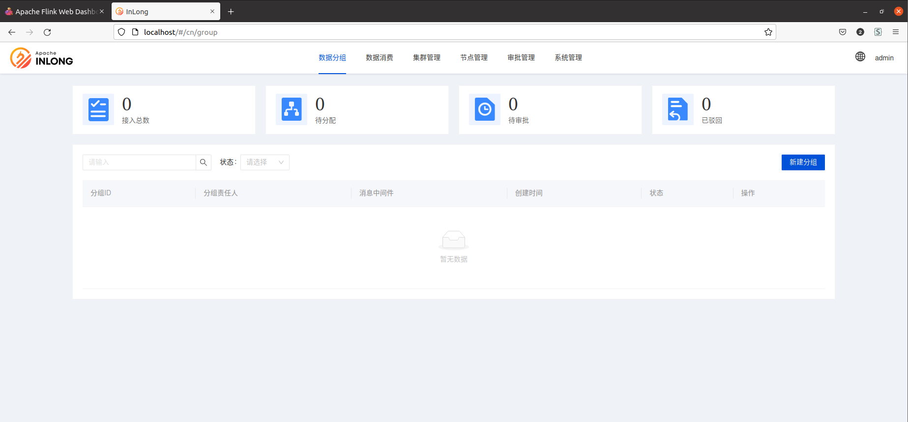

注：若进入Inlong后未显示登录界面，而是直接跳转至首页且右上角无用户名，同时有http error弹出，稍作等待刷新即可。

### 参考链接

`https://inlong.apache.org/zh-CN/docs/introduction`